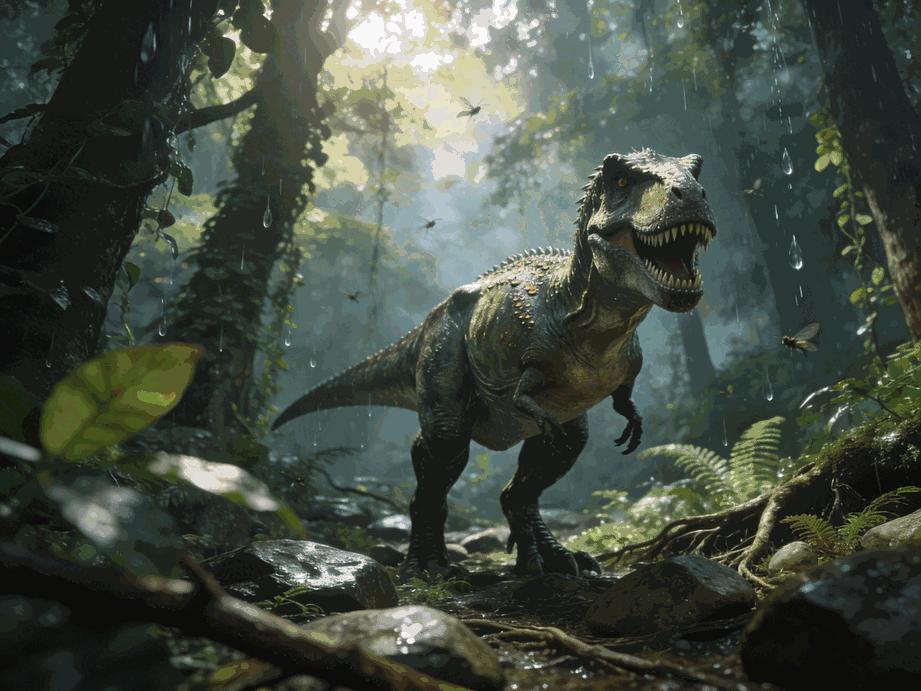
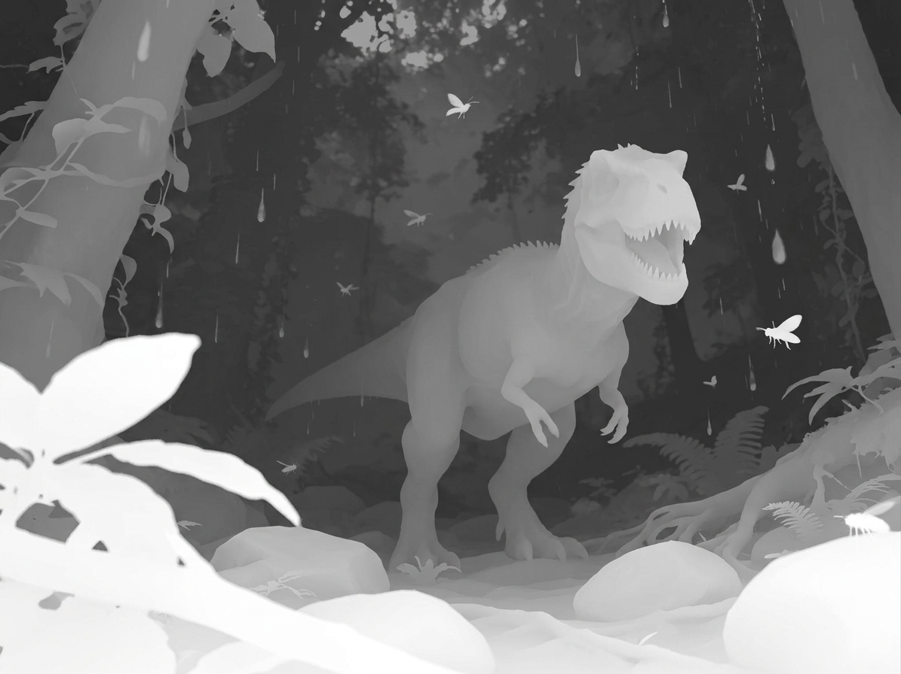
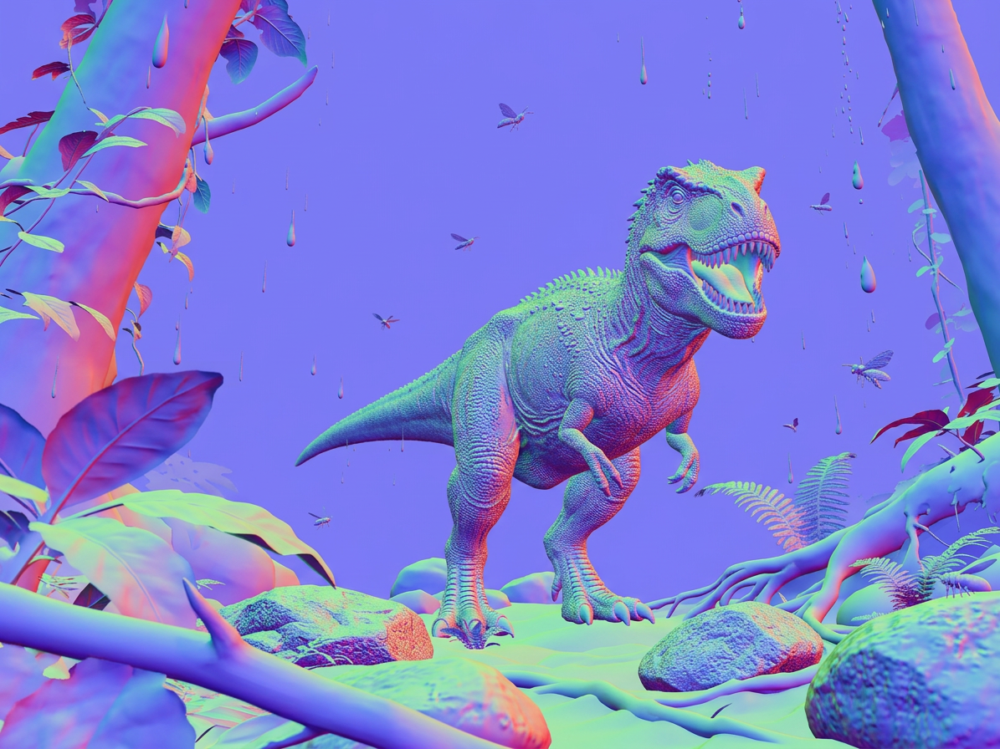
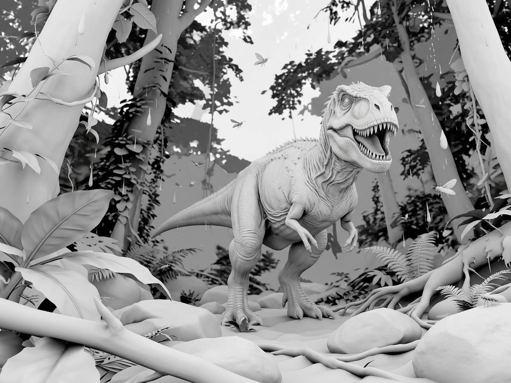

# Integral Image — WebGL Parallax 3D Simulator

A browser-based proof of concept that simulates the visual effect of a **lenticular lens sheet** applied to a flat 2D image, creating a convincing depth-into-screen 3D illusion in real time.

The effect runs entirely in the browser — no server, no plugins. Upload any image and the app generates depth, normal, and ambient occlusion maps on-device using an AI model, then renders the parallax effect through a custom GLSL shader driven by your mouse, gyroscope, or webcam.



---

## How It Works

### 1. Depth Map Generation (AI, on-device)

When you upload an image, the app runs **Depth Anything V2** locally in your browser using ONNX Runtime Web via `@huggingface/transformers`. The model outputs a relative depth map where **white = near** and **black = far**.

The model is downloaded once (~90 MB) and cached in the browser for future sessions. No data leaves your device.

**Model fallback chain** (tries in order):
| Model | Size | Notes |
|---|---|---|
| `onnx-community/depth-anything-v2-base` | ~90 MB | Primary — best quality |
| `onnx-community/depth-anything-v2-small` | ~25 MB | Fallback |
| `Xenova/depth-anything-small-hf` | ~49 MB | Last resort |

### 2. Surface Map Generation (CPU)

From the depth map, two additional maps are computed on the CPU:

- **Normal Map** — derived from a 5×5 Sobel kernel applied at full resolution. Encodes surface orientation as RGB. Used for dynamic lighting that follows the viewer.
- **Ambient Occlusion Map** — derived from local depth variance. Darker in concavities, brighter on exposed surfaces. Adds perceived volume.

### 3. Parallax Rendering (WebGL / GLSL)

A Three.js full-screen quad renders all four maps through a custom GLSL shader:

- **Far-anchored parallax**: background (depth=1) stays fixed; foreground moves most. Displacement follows a quadratic curve `nearness = (1 - depth)²` so near objects feel strongly separated from the background.
- **Edge suppression**: depth discontinuities are detected via `dFdx/dFdy` and suppressed with `smoothstep` to prevent fringing artifacts at object boundaries.
- **Normal-map lighting**: a virtual light follows the viewer position, brightening surfaces facing the viewer and adding subtle depth cues.
- **AO contribution**: concavities are darkened proportionally to local variance, also suppressed at edges.
- **Movement cap**: parallax offset is hard-capped at ±0.35 to prevent visible smearing at extreme positions.

### 4. Tracking Modes

| Mode | How it works |
|---|---|
| 🖱 Mouse | Normalized cursor position across the viewport |
| 📱 Gyro | `DeviceOrientation` API — tilt the device |
| 📷 Webcam | Chrome 113+ `FaceDetector` API; motion-centroid fallback on other browsers |
| ▶ Animate | Automatic Lissajous figure-8 loop (0.18 Hz × 0.09 Hz) |

---

## Pipeline Visualization

| Original | Depth Map | Normal Map | AO Map |
|:---:|:---:|:---:|:---:|
|  |  |  |  |

The **Depth Map** separates foreground (white/bright) from background (dark). The **Normal Map** encodes surface orientation as color — blues/purples face the camera, reds/greens face sideways. The **AO Map** reveals surface concavities as darker regions, adding perceived volume to the flat image.

---

## Tech Stack

| Layer | Technology |
|---|---|
| Rendering | [Three.js](https://threejs.org/) r160, WebGL, GLSL ES |
| AI inference | [@huggingface/transformers](https://github.com/huggingface/transformers.js) (ONNX Runtime Web) |
| Depth model | Depth Anything V2 (base/small) |
| UI | React 18, inline styles |
| Build | Vite 5 |
| Tests | Vitest + Testing Library (58 tests) |

---

## Getting Started

```bash
npm install
npm run dev
```

Open `http://localhost:5173`. On first load the AI model downloads (~90 MB) and is cached. Click **Load Demo Scene** or upload your own image from the panel on the right.

### Running Tests

```bash
npm test
```

Tests cover: math utilities, shader/renderer configuration guards, animation parameter locks, depth model integration, and component behavior.

---

## Project Structure

```
src/
├── App.jsx                      # Root component, state management
├── components/
│   ├── ParallaxRenderer.js      # Three.js WebGL renderer + uniforms
│   ├── DepthMapGenerator.js     # AI depth + normal + AO pipeline
│   ├── HeadTracker.js           # Mouse / gyro / webcam tracking
│   ├── Controls.jsx             # Side panel UI
│   └── ImageLoader.jsx          # Drag-and-drop image input
├── shaders/
│   ├── parallax.vert.glsl       # Pass-through vertex shader
│   ├── parallax.frag.glsl       # Main parallax + lighting shader
│   └── lenticular.frag.glsl    # Lenticular overlay function
├── utils/
│   ├── mathUtils.js             # lerp, clamp, smooth, smooth2D
│   └── imageUtils.js            # Image loading helpers
├── resources/                   # Demo image + sample maps
└── tests/
    ├── unit/                    # mathUtils, shader config, animation params
    ├── integration/             # Depth pipeline + model fallback
    └── component/               # App preload + overlay behavior
```

---

## Key Shader Parameters

These values are locked by the test suite — changing them will cause test failures, signaling an intentional configuration change.

| Parameter | Value | Effect |
|---|---|---|
| `uSensitivity` | 2.2 | Global parallax strength multiplier |
| Strength formula | `nearness × edgeFactor × 0.04` | Per-pixel displacement scale |
| `uLightStrength` | 0.12 | Normal map lighting intensity |
| AO factor | `× 0.4` | AO contribution weight |
| Parallax cap | ±0.35 | Max offset before edge smearing |
| Edge smoothstep | `(0.006, 0.02)` | Depth discontinuity suppression range |
| Nearness curve | `pow(1 - depth, 2.0)` | Quadratic depth-to-displacement mapping |

---

## Browser Support

| Browser | Mouse | Gyro | Webcam (FaceDetector) |
|---|---|---|---|
| Chrome 113+ | ✓ | ✓ | ✓ |
| Chrome Android | ✓ | ✓ | ✓ |
| Firefox | ✓ | ✓ | motion fallback |
| Safari iOS 15+ | ✓ | ✓* | motion fallback |

*iOS requires a permission prompt for `DeviceOrientation` — handled automatically.

---

## Limitations

- The depth model runs in the main thread — large images may cause a brief pause on first inference.
- Webcam face tracking requires Chrome 113+ for the native `FaceDetector` API; other browsers use a motion-centroid fallback.
- Parallax is a 2D illusion — extreme viewing angles reveal the flat nature of the source image.
- Object boundary artifacts can appear where depth changes abruptly; edge-masked blur and shader edge suppression minimize but do not eliminate this.
